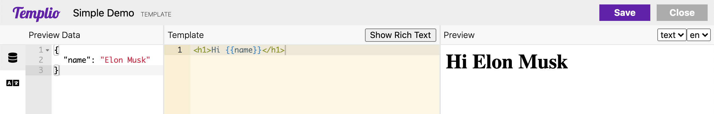

# Getting Started 🚀

You're ready to get started with Templio, great! 💪

We've split up these guides into the main concepts of Templio, and will explain each of them in detail in their own section.

You should also check out the very simple [API Documentation](https://templio.stoplight.io/docs/templio-docs/reference/Templio-API.v1.yaml/paths/~1render/post), for details on how exactly to use the render endpoint.

1. [Templates](./1-Templates.md)
2. [Layouts](./2-Layouts.md)
3. [Pre-processors](./3-Pre-processors.md)
4. [Translations](./4-Translations.md)
5. [The editor](./5-Editor.md)
6. [Rendering](./6-Rendering.md)

## Quick demo

In this section, we will walk through a simple workflow from editing to rendering, in two quick steps. 

### 1. Edit template

We've created a new template and opened the editor. We will keep it really simple, with a quick "Hello". In the left pane, we defined the preview data, used for editing. We expect to receive a `name` in the request, so I add an example here in the preview:



### 2. Render template

Rendering is as simple as sending a `POST` request to `https://api.templioapp.com/render?={template-slug}`.

As we saw when we edited the template, the input data expects a `name` property. We will send that in the JSON body in the request:

```json
{
  "data": {
    "name": "Elon Musk"
  }
}
```

The response will, by default, be a JSON object with the rendered template in the `result` property:

```json
{
  "result": "<h1>Hello Elon Musk!</h1>"
}
```

You can try to query the Render API directly in the widget below, just press 'Send'!

```json http
{
  "method": "post",
  "url": "https://api.templioapp.com/render?template=simple-demo",
  "headers": {
    "Authorization": "Apikey 1762a910a46a7a4de325ddd847e250832ac645fcf9089e405b95298f64658386",
    "Content-Type": "application/json"
  },
  "body": { "data": { "name": "Elon Musk" } }
}
```

You can try and change the `name` in the `data` property, to see the template rendering with different date.

There's a ton more you can do with Templio, but we hope you got the gist of it in this brief demo.
