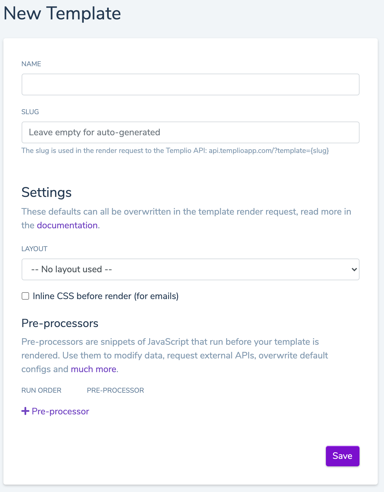

# Templates

Templates is at the core of Templio, and that's why we will start here.

Templates are `HTML` documents, enhanced with the [Liquid](https://shopify.github.io/liquid) templating language. This allows you to render variables and build advanced logic within your templates.

You can use [layouts](./2-Layouts.md) to define and re-use html, such as a header and footer. The template content will be rendered inside the layout.

The data provided to the template is known as `input data`. This data can be used directly as is, or be transformered via powerful javascript [pre-processors](./3-Pre-processors.md). You can even fetch additional data from external APIs that you need for your rendering!

When you've build your template, you send a simple request to our [Render API](https://docs.templioapp.com/docs/templio-docs/reference/Templio-API.v1.yaml/paths/~1render/post) and we will return you the final, rendered template in no time ⚡.

## Creating a new template

To create a new template, go to `Templates` in the top menu and click `New Template`.

There's serveral inputs you need to fill out:

* **Name** - A name of the template, for you and your team to easily recognize the template.
* **Slug** - An identifier used when calling the Render API to identify this template, for example `my-template`.
* **Layout** (optional) - If you wish to use a [layout](./2-Layouts.md), select it here.
* **Inline CSS** (optional) - If your template is used as an email, you should check this, which will inline the CSS for maximum compatability with email clients.
* **Pre-processors** (optional) - Add the [pre-processors](./3-Pre-processors.md), if any, you wish to apply before rendering.

All of these settings can be edited at a later point, except the `slug`!

Click `Save` and [the editor](./5-Editor.md) will open up directly.

