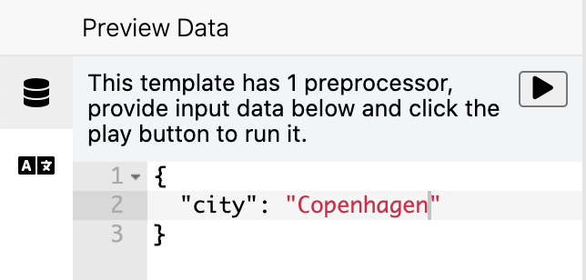

# The editor

The template editor is a core component of Templio, and we're dedicated to building the best and easiest editor - so you don't have to!

We have plans to support different type of editors, such as simple Rich Text/WYSIWYG and block-style editors, but for now we're focusing on building a great code editor.

The editor has 3 sections or panes:

## Left pane - Inputs

In this pane, you have all the inputs necessary for your template render, and it's easy to view/edit the inputs when editing your template.

### Preview Data

If your template needs `input data` to render, you can write in an example of the JSON data, and it will be used for the preview while you are working in the editor. The preview data will be saved, so you can quickly get started editing next time.

If you have assigned any [pre-processors](https://templio.stoplight.io/docs/templio-docs/docs/Pre-processors.md) to your template, you will have the option to run the pre-processors on the input data you define, and the data will transform to the final state (after all pre-processors has run). You can easily switch back to the original preview data and trigger pre-proccesors to run again.

### Translations
If you are using translations, you can view all the keys and values in the translations pane.

## Middle pane - Editor

## Right pane - Preview

Preview Data
Pre-processors
Languages