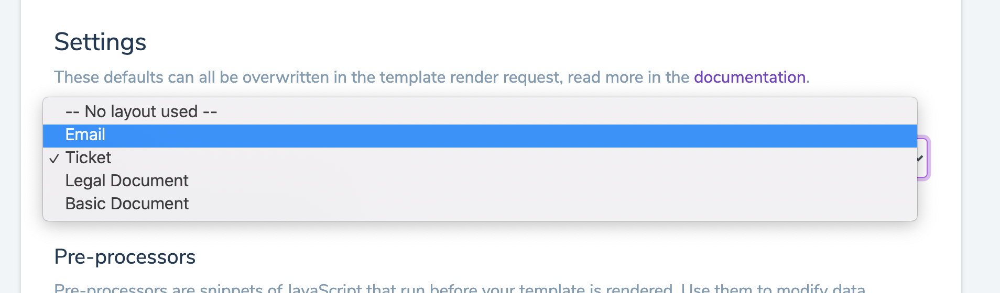

# Layouts

With layouts, you can re-use template code across multiple templates, like sharing the same header and footer.

The layouts use the same editor as the templates, including live preview.

All `input data` are available to layouts, just like templates.


## Render content within your layout

In order to render the template content within your layout, insert the `{{content}}` Liquid variable where you want your template content rendered.

```html
<html>
  <body>
    <header> ... </header>
    {{content}}
    <footer>  ... </footer>
  </body>
</html>
```

If we, for example, had the following template:

```html
<h1>Hi there!</p>
<p>Thank you for your reservation. We look forward to welcoming you!</p>
```

And we added the above layout to the template, the final render would be:

```html
<html>
  <body>
    <header> ... </header>
    <h1>Hi there!</p>
    <p>Thank you for your reservation. We look forward to welcoming you!</p>
    <footer>  ... </footer>
  </body>
</html>
```

## Add layout to template

For each template you want to render within a layout, go to the template settings and select the layout you wish to use.




Be aware that when you update a layout, all template renderings using this layout will be immiediately affected.