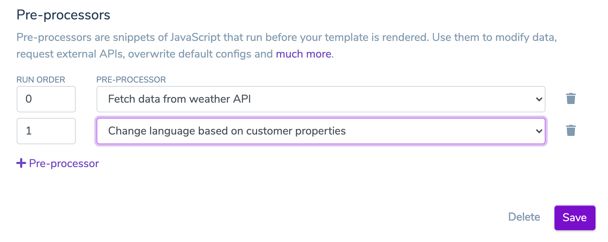

# Pre-processors

One of the most powerful features are Templio's Javascript pre-processors. A pre-processor is a snippet of Javascript code which receives `input data` and render configuration as input, and returns the same. Within the code, you can modify your data and change the rendering logic. It gives you _a lot_ of power over your templates. 

Pre-processors are great if you need to:

* Use advanced logic that is not easily doable in Liquid
* Transform input data into a different structure
* Fetch additional data from external APIs
* Overwrite render configuration, such as language, based on input data
* Anything else you do with Javascript and your data

Pre-processors can be chained, and will run in the order you specify for each template.

## Creating a pre-processor

Every pre-processor starts with the following code:

```javascript
module.exports = (input) => {
  // Modify input here, make sure to return a data property
  return input;
};
```

You can any write any Javascript code and [use NPM packages](#Using-npm-packages) - as long as you `return input` at the end.

The `input` variable contains the input data (`input.data`) sent to the template (or the result of a previous pre-processor if chained). You can also overwrite certain render configurations, such as language, by setting `input.language`.

If we, for example, send a list of order items with prices in our input data:

```json
{
  "data": {
    "orderItems": [{ "name": "Rocket", "price": 1000 }, { "name": "Rocket Fuel", "price": 50}]
  }
}
```

And we wish to sum the prices for a total amount, we easily do it with a pre-processor:

```javascript
module.exports = (input) => {
  
  input.totalAmount = input.data.orderItems.reduce(function(acc, orderItem) { return acc + orderItem.price }, 0)

  return input;
};
```

The output of the pre-processor will be:

```json
{
  "data": {
    "orderItems": [{ "name": "Rocket", "price": 1000 }, { "name": "Rocket Fuel", "price": 50}],
    "totalAmount": 1050
  }
}
```

## Assigning pre-processors to a template

In the template settings, you will find an option to add pre-processors:



You can add multiple pre-processors and chain them together, just remember to define the run order of the pre-processors.


## How does it work?

Rendering of the templates happens in an AWS Lambda function. If there's any pre-processors assigned to the template, the Lambda will fetch the code and execute each code snippet in the run order defined. 

In the `Render Logs` inside Templio, you can view each render, and how each pre-processor was executed, with the input and outputs. This is a good place to start to debug any problems.

## Using npm packages

We currently support the following npm packages:

* `moment`
* `axios`

If you need to use any other packages, please contact us and we add them for you.

You can require and use the packages like this:

```javascript
module.exports = (input) => {
  const axios = require('axios');

  return input;
};
```


## Advanced use cases
### Change language

The language used for rendering a template can be overwriten inside a pre-processor. For example, you might have some `input.data` from which you can set the language, instead of sending the `language` property as part of the render request.

```javascript
module.exports = (input) => {
  
  input.language = input.data.customer.language;

  return input;
};
```

### Request external data

By using pre-processors to fetch data needed for the template rendering, you can make your integration with Templio much more flexible. Instead of having to update the Render API request when new properties are needed, they can be fetched automatically from your API.

Pre-processor input data:
```json
{
  "data": {
    "reservationId": 4390850423
  }
}
```

External API response:
```json
{
  "reservedBy": "Elon Musk",
  "tableNo": 34,
  "guests": 6
}
```

Pre-processor fetching from external API:
```javascript
module.exports = async (input) => {
  const axios = require('axios');
  
  return axios.get('http://api.myservice.com/reservations/' + input.data.reservationId)
  .then(function (response) {
    input.data = {...input.data, ...response.data}
	  return input;
  }).catch(error => ({data: error, config: {}}))
}
```

Pre-processor output data:
```json
{
  "data": {
    "reservationId": 4390850423,
    "reservedBy": "Elon Musk",
    "tableNo": 34,
    "guests": 6
  }
}
```

