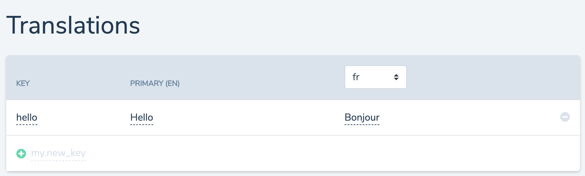
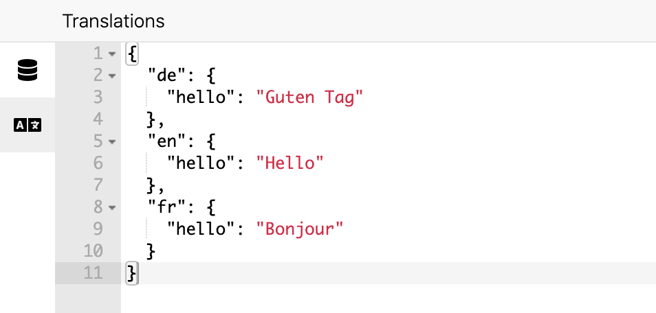
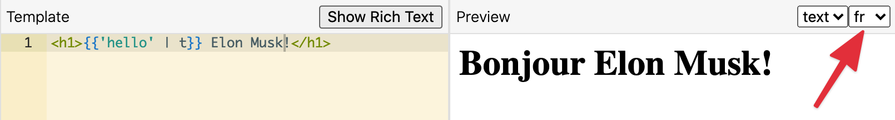

# Translations

Templio supports localized (or multi-lingual) templates. We have experienced the pain of maintaining multiple templates, for a handful of different languages and it quickly becomes a big headache to manage.

With translations, you can have **one** template for all the languages, and instead define the translatable strings outside the template.

You can use Templio's own translation feature to add translatons, or you can choose one of our integrations to external translation management services.

## Enable languages in project settings

In order to add language support, go to project settings (click your name in upper right corner, click on the project) and choose the additional languages you wish to support.

## Adding a new translation string

Go to `Translations` in the top menu and click next to the "+" to add a new translation key. The key is what you will reference from the templates. Write in the translated values for the languages you've configured.




## Use translations in templates

In the left pane, you can switch to the translations tab and show all your available translations:



When writing your template, you use the Liquid syntax for translations:

```html
<h1>{{ 'hello' | t}} Elon Musk!</h1>
```

The render will show the localized string, based on the language set in `input.language`. This can be set from the [Render API](https://templio.stoplight.io/docs/templio-docs/reference/Templio-API.v1.yaml/paths/~1render/post) request, or from a [pre-processor](./Pre-processors.md).

In the preview, it will fetch the translation for the language selected:




## Translation service integrations

If you are already managing translations with a translation management service, or if you have _a lot_ of translations and languages, you can use one of our integrations for translation services.

We will fetch the translations from the service, and you can work with them in the editor as described above. 

Go to `Project Settings` -> `Integrations` and enable the integration you wish you use.

We currently support [Locize](https://www.locize.com) and are adding more as we go. If you need an integration, please contact us.

